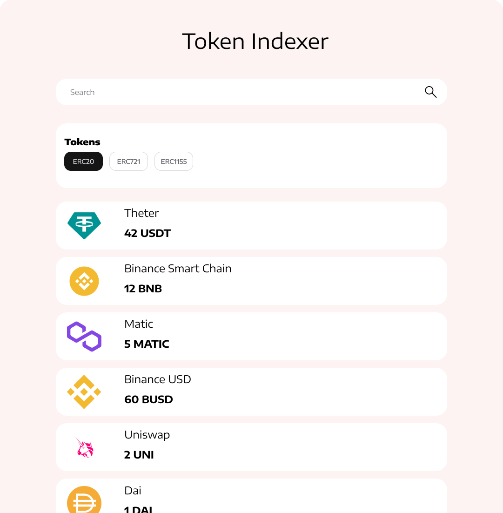

# Token Indexer

[Figma Design - Prototype](https://www.figma.com/file/cQX1sBfMwsI4W0RRHo9n91/Token-Indexer?node-id=0%3A1&t=yT2m4IAiRKL12gex-1)

## Run

1. Install dependencies by running `npm install`
2. Start application by running `npm run dev`

### Social Networks:

  
  
  

